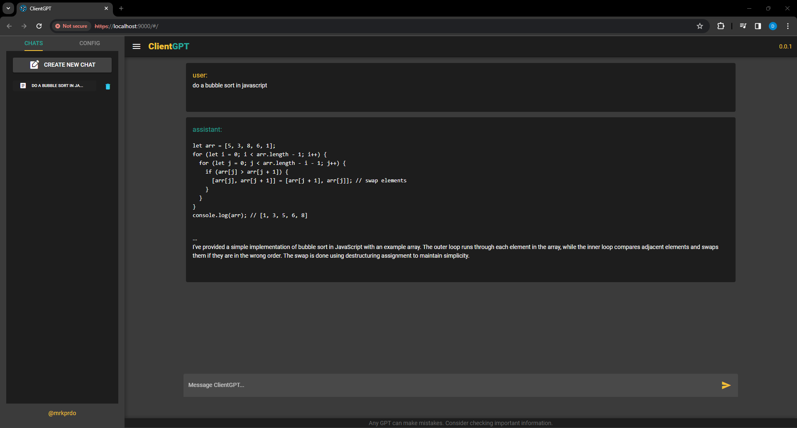
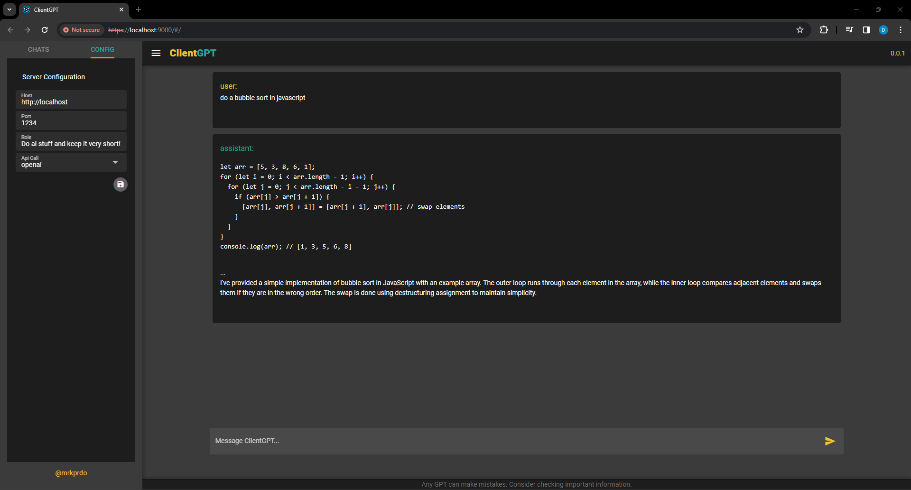
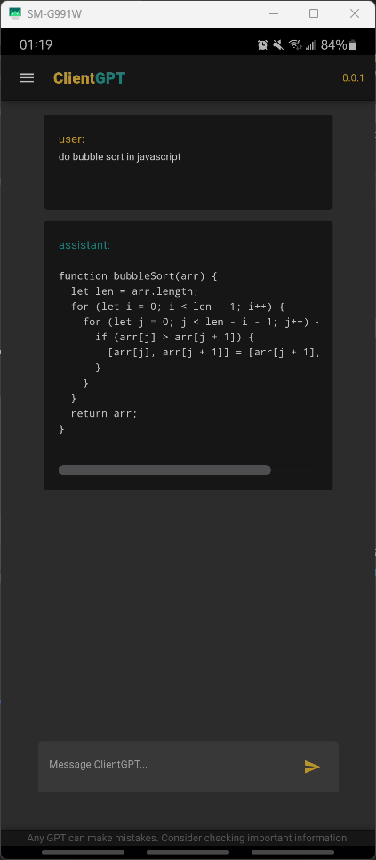
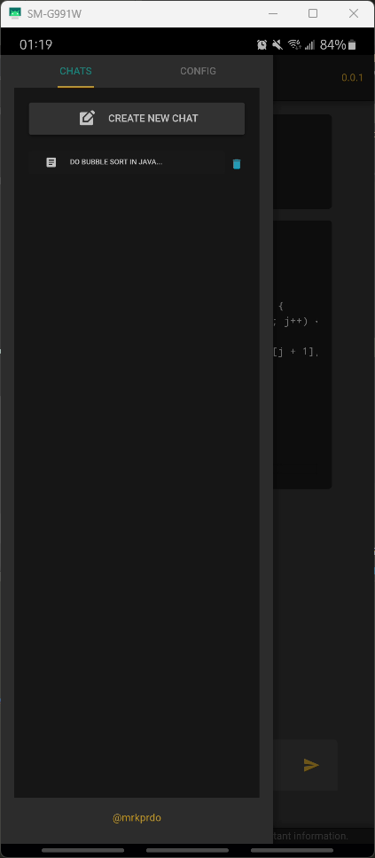
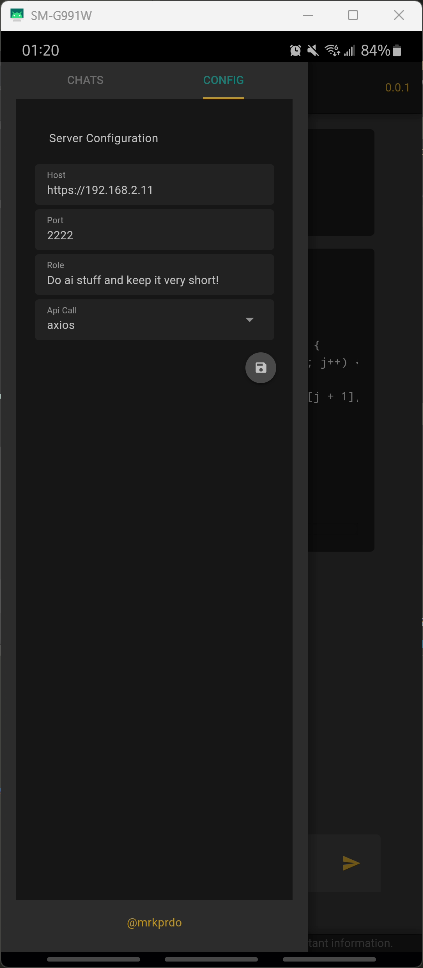

# ClientGPT

ClientGPT is an application designed to interact with large language models. Ideally you need to have your own models deployed (ex. LM Studio). You can then build this as a web app 🖥️ or android app 📱.

## Features

- **Chat Interface**: Dialogue emulates the structured exchange of information between a User and an inferred GPT model, characterized by input provided by the User and corresponding output generated by the model. Also supports a bit of markdown formatting.
- **Chat History**: Stores interactions as a log of chat history.
- **Server Configuration**: Enables the user to specify the server configuration for hosting their models.

## Developement

### Run as Web App Dev

```bash
yarn install
yarn dev
```

### Run as Android Dev

- Requirements, JDK11, Android Studio & Build Tools, Gradle 7.4

```bash
yarn install
# make sure you have emulator running or android device connected
# allow adb connection
yarn dev -m cordova -T android

```

### Build as Web App

```bash
# build files will be in dist folder, grab them and deploy in your server app
yarn build
```

### Build as Android

```bash
# building in android will generate aab files, needed to convert to apk in order to install it
# you need to set it as debugging enabled to build the apk and install to your device
yarn build -m android -d
adb install <path-to-apk-in-dist-folder> <device-id>
```

## Screenshots:

### Web App




### Android App

||||

## Get Help

If you encounter any issues or have questions, feel free file an issue. Will try answering it.

More info:

- https://quasar.dev/docs
- https://github.com/openai/openai-node
- https://cordova.apache.org/docs/en/latest/
